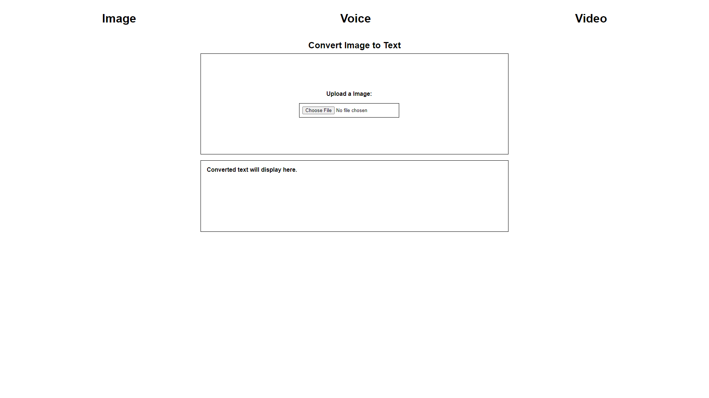

# Multimodal Text Conversion

I created this multimodal text conversion using tesseract.js library and webkitspeechrecognition api and framework jquery.You can use image, voice, and video to convert into text.

## Demo link:

- tex-con-img-vc-vid-gce.netlify.app/
  
